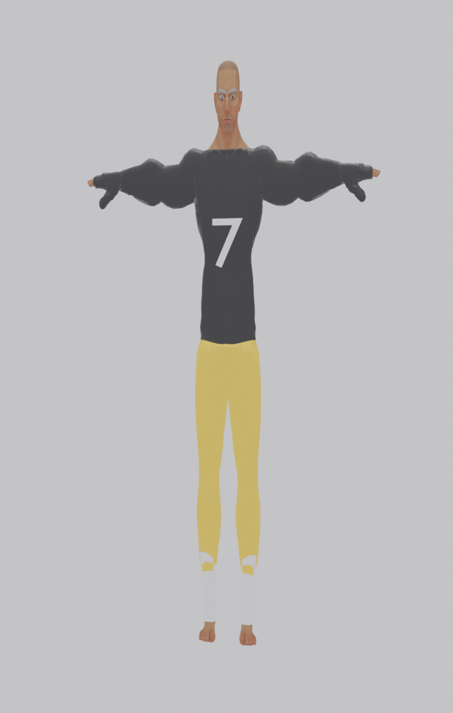
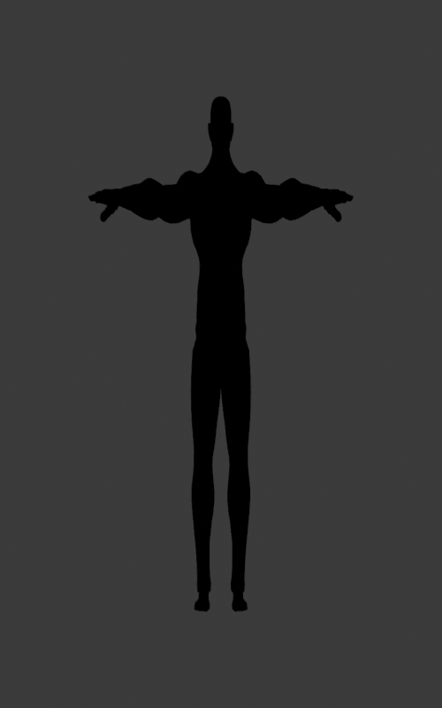
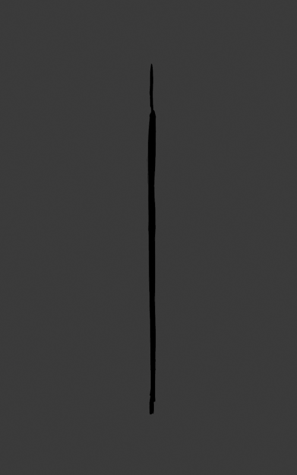
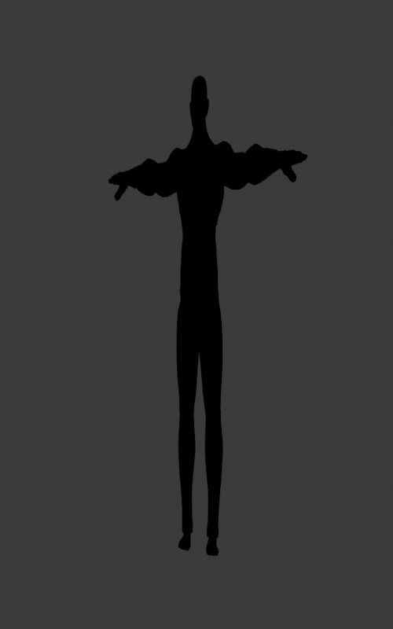

# Example: Football Uniform

A reproducible build script that takes the Quaternius Superhero_Male base mesh and produces a complete game-ready football player character: black jersey with white "7", gold pants, white socks. End-to-end, **one command**, from base mesh to `.glb` ready for any Godot 4 project.



| Front silhouette | Side silhouette | 3/4 silhouette |
|---|---|---|
|  |  |  |

This example exists to:
1. **Prove the pipeline end-to-end** on the smallest character you can build that still exercises every stage (gross proportion edits, body-topo costumes, text decals, glTF export)
2. **Serve as a recipe** you can copy-modify for your own characters
3. **Demonstrate stage gates** — silhouette renders before/after, output renders, polycount stats per piece

The total character is **~10k verts / ~38k tris** before clothes-overlap masking, well within typical game character budgets.

---

## Running it

After completing [SETUP.md](../../SETUP.md), from the repo root:

```bash
blender --background --python examples/football_uniform/build.py
```

That's it. About 5 seconds of execution. The script produces:

```
examples/football_uniform/
├── output/                          (regeneratable, NOT in the repo)
│   ├── Lineman_Footballer.blend   (~11 MB, Blender source file)
│   └── Lineman_Footballer.glb     (~12 MB, game-ready glTF)
└── renders/                         (committed for showcase preview)
    ├── final_review.png             (full-color hero shot)
    ├── silhouette_front.png         (silhouette gate verification)
    ├── silhouette_side.png
    └── silhouette_3q.png
```

The `output/` directory is gitignored (`.glb` and `.blend` are large + easily regeneratable). Run `build.py` to populate it on your machine.

---

## What it does, stage by stage

The build script (`build.py`) runs through 6 stages, each in its own function (so you can comment out individual stages while debugging):

### Stage 1: Import base mesh
Uses `scripts/headless_import.py` to load the Quaternius `Superhero_Male_FullBody.gltf` and prune any stray objects. Result: 7281-vert body + 556-vert Eyes + 646-vert Eyebrows + 65-bone Armature.

### Stage 2: Proportion edits via lattice
Wraps the body+eyes+eyebrows in a 5×5×9 proportion lattice (using `scripts/lattice_setup.py`), applies three coordinated edits:
- Upper-body lift (+6cm) on layers W=4..8
- Lower-body drop (-4cm) on layers W=0..3
- Waist X-pinch (±4cm inward) at layer W=4

Net effect: character is ~10cm taller with longer legs and a slight V-taper at the waist. Then bakes the lattice into geometry and removes the lattice object.

### Stage 3: Silhouette gate
Switches to the Workbench engine with flat-black materials and white background, renders front/side/3-quarter views to `renders/`. **Check these before continuing — if the silhouette doesn't read, abort and adjust proportions.**

### Stage 4: Costume pieces (body-topo)
Uses `scripts/body_topo.py`'s `build_bodytopo_garment(...)` to construct three costume meshes:

| Piece | Z range | X cutoff | Color | Result |
|---|---|---|---|---|
| Jersey | 0.95 – 1.55 | \|x\| < 0.45 (short sleeve) | Black | 1,266 verts / 2,402 polys |
| Pants | 0.22 – 0.95 | none | Gold | ~885 verts / ~1,686 polys |
| Socks | 0.05 – 0.27 | none (yields L+R sock islands) | White | ~352 verts / ~574 polys |

All three inherit the body's 65 vertex groups → bound to the rig automatically.

### Stage 5: Jersey number "7"
Creates a 3D text mesh, rotates it to face forward, applies a Shrinkwrap modifier (PROJECT mode along Y axis) to conform it onto the jersey's chest surface. Then parents to the armature and weights all 24 verts to the chest bone (`spine_03`) so it deforms with the character's torso during animation.

### Stage 6: Save .blend + export glTF
Saves the source `.blend` and exports a `.glb` with `export_animation_mode='ACTIVE_ACTIONS'` (per the project's CLAUDE.md guidance — the default `ACTIONS` mode exports orphaned actions too, which produces duplicate animations).

---

## Making your own character based on this

The fastest path to your own character is:
1. **Copy this folder** to `examples/<your_character>/`
2. **Edit the parameters** at the top of `build.py`:
   - `CHARACTER_NAME`
   - Color constants (`JERSEY_BLACK`, `PANTS_GOLD`, etc.)
   - Proportion deltas (`UPPER_BODY_LIFT`, `LOWER_BODY_DROP`, `WAIST_PINCH`)
   - Cut conditions in the `jersey_keep`, `pants_keep`, `socks_keep` predicates
3. **Run** with the same command

Each character is a one-file edit from the previous one. The pipeline itself (helpers in `scripts/`) doesn't change.

For more elaborate edits — different costume pieces, more proportion control, asymmetric features — see [docs/body-topo-recipe.md](../../docs/body-topo-recipe.md) and [docs/lattice-proportions.md](../../docs/lattice-proportions.md).

---

## Known limitations of this example character

- **No hair** — the Superhero base ships bald, and hair authoring is a separate pattern (not body-topo; usually card-based or sculpted). Adding hair is out of scope for this example.
- **No shoes / cleats** — they'd be modeled separately and parented to foot bones (hard-item pattern, not body-topo).
- **No helmet** — same reason. The example character's head shape was deliberately not polished because in real use a helmet would cover it.
- **Default Blender font** for the "7" — only 24 verts. Looks blocky up close; reads fine at gameplay distance. To use a custom font, change `num.data.font` in stage 5.
- **Body has multi-image-texture warning on glTF export** — comes from the Quaternius base material. Cosmetic warning, doesn't block import.

These are all addressable; they're skipped here to keep the example focused on what's most-reusable (body-topo costume + lattice proportions + decal).

---

## Comparing the output to real expectations

The output Lineman in Godot looks **engineering-quality, not portfolio-quality**. Specifically:
- Front view: reads correctly as a heavyset athletic male in uniform
- Side view: has residual proportion artifacts from the lattice that would require sculpt-mode cleanup to fix
- The body shape is anatomically realistic, not Coraline-style exaggerated (the lattice does a small push in that direction but doesn't go far)

If you're after polished portfolio character art, this example isn't the target — sculpt your character against this as a topology base and polish from there. If you're after a working pipeline that produces playable test characters in <10 seconds per character, this *is* the target.
